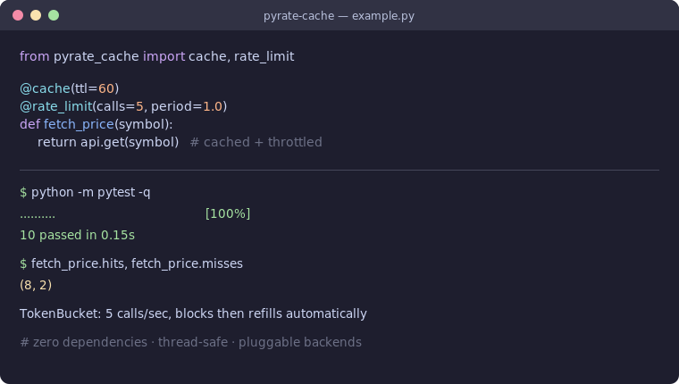

# pyrate-cache

[](https://github.com/JCreatesGH/pyrate-cache/actions)
[](https://www.python.org/)
[](LICENSE)

Tiny, **zero-dependency** rate limiting and caching decorators for Python. Thread-safe, with pluggable cache backends and a proper token-bucket limiter.



## Install

```bash
pip install pyrate-cache
```

## Usage

```python
from pyrate_cache import cache, rate_limit

@cache(ttl=60)                       # memoize results for 60s
def fib(n):
    return n if n < 2 else fib(n - 1) + fib(n - 2)

@rate_limit(calls=5, period=1.0)     # at most 5 calls/sec (blocks)
def call_api(url):
    return requests.get(url)

@rate_limit(calls=100, period=60, block=False)  # raise instead of waiting
def webhook(payload):
    ...
```

### Why

- **`@cache`** — TTL expiry, `.hits` / `.misses` counters, `.cache_clear()`, and any object with `get/set/clear` works as a backend (swap in Redis in one line).
- **`@rate_limit`** — real [token bucket](https://en.wikipedia.org/wiki/Token_bucket): smooth limiting, burst capacity, blocking *or* non-blocking (`RateLimitExceeded`).

### Custom backend

```python
from pyrate_cache import cache

class RedisCache:
    def get(self, key): ...
    def set(self, key, value, ttl): ...
    def clear(self): ...

@cache(ttl=300, backend=RedisCache())
def heavy(x): ...
```

## Development

```bash
python -m pytest -q     # 10 tests, runs in <1s
```

## License

MIT
